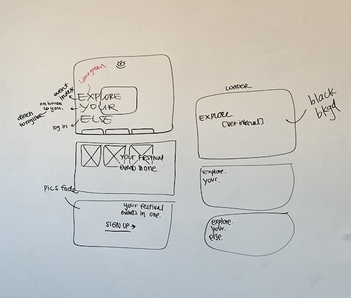

#  Group Project - Full Stack CRUD App

Group project using CRUD and RESTful APIs.

### Objective of the website

This website allow users to organize their event schedule, without the hassle of visiting multiple event's websites.

### Visit website

[Click here to visit!](https://still-taiga-70572.herokuapp.com/)

###### Wireframes

###### User Story

When the page loads, the user will see an animation on the loading page. It directs the user to the main home page. On the home page, the user is able to scroll through the page and see upcoming, as well as past events. On the bottom, the user is able to click on the 'Sign Up' button that directs them to a form to create an account. 
If the user already has an exisiting account, they are able to click on to 'Log In' link, on the bottom of the register page. 
Once logged in, the page lays out the events the user is interested in attending. If none, there will be a message alerting the user to add events.
The Events page will lay out the upcoming events, and the user is able to click on the event's name to read more about that specific event. That page will also have a playlist, that allows the user to listen to the event's music genre. This nifty addition will aid the user on deciding whether that event is for them or not.
Upon making the decision, the user can click the '+' sign, next to the event's name. The added events will show up on the user's account. There the user is allowed to delete the event from their list as well. 
Once finished browsing through the website, the user can click the 'Log Out' link on the navigation bar on the top right.

### Built With

* HTML/CSS/Javascript
* [Mongoose](https://mongoosejs.com/)
* [MongoDB](https://www.mongodb.com/)
* [npm Express](https://www.npmjs.com/package/express)
* [Google Fonts](https://fonts.google.com/)

### Authors

* **Rogelio Hidalgo**
* **Hrak Torousian**
* **Sky Yoo**

### Acknowledgements

* [Stack Overflow](https://stackoverflow.com/)
* [Dribbble](https://dribbble.com/)

##### Additional Features To Add

* On home page, users can scroll left or right to view the past events' posters.
* On each event show page, the users are able to add comments and review the event.
* Include a chatbox, where users can interact with one another.
* Add set times and a map for each festival.
